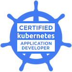
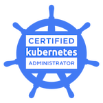
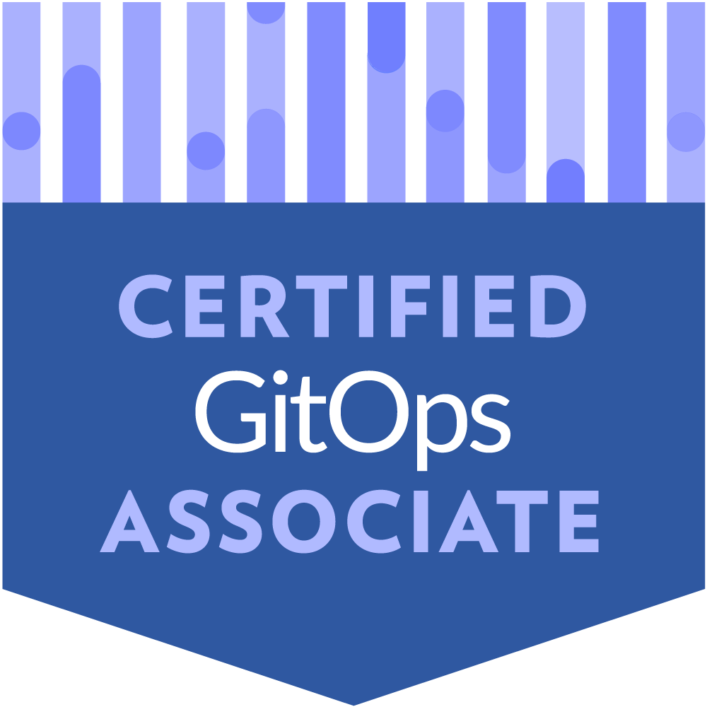

<h2 align="center$">Hi there! I'm Brahim SLIMANI 👋</h2>

I'm a Passionate DevOps Engineer, I've mostly worked professionally in several IT projects. Experienced with full SDLC stages across variety of technologies. Possessing strong knowledge of building, deploying and securing cloud-based applications and container-orchestration chiefly with Kubernetes.

- I'm currently working as FSD & DevOps consultant for PoliScrypts IT Consulting.
- I am progressing in mastering cutting-edge technologies with aim of varying and improving my technical compass.
- Available to collaborate on open-source projects. <!--- Ask me about software engineering and web development topics, I'll be pleased to help you. -->
- Reach me out to discuss further interesting topics (Coding, Cloud & Edge computing, Web Development...) 📧 Mailto: [slimani.ibr@gmail.com](slimani.ibr@gmail.com) | [brahim.slimani@poliscrypts.be](brahim.slimani@poliscrypts.be)
- Open for freelance projects across b2b fixed-term contract, even for long-term commitment 🚀

<!-- CONTACT LINKS -->

<!---->
<!---->

 

## IMPROVEMENTS
<!--

  
<a href="https://www.credly.com/badges/8336d3ad-0e8b-439a-b6ff-4fe98084b1a0/embedded" >

Certified K8s App Developer
</a>
&nbsp;&nbsp;&nbsp;&nbsp;&nbsp;&nbsp;&nbsp;&nbsp;&nbsp;&nbsp;&nbsp;&nbsp;&nbsp;&nbsp;&nbsp;&nbsp;&nbsp;&nbsp;
<a href="https://www.credly.com/badges/8d51ab93-45ce-44f3-a0ca-86749f9902b8/embedded" >

  Certified K8s Security Specialist
</a>
&nbsp;&nbsp;&nbsp;&nbsp;&nbsp;&nbsp;&nbsp;&nbsp;&nbsp;&nbsp;&nbsp;&nbsp;&nbsp;&nbsp;&nbsp;&nbsp;&nbsp;&nbsp;
<a href="https://www.credly.com/badges/39b474b0-c6ee-492d-b945-560a58f681d2/embedded" >

  Certified K8s Administartor
</a>

-->

  <!--
    
<small>Small Text 1</small>    &nbsp;&nbsp;&nbsp;       <small>Small Text 2</small>     &nbsp;&nbsp;&nbsp;      <small>Small Text 3</small>
-->

<table style="border:0px solid white; width:100%;">
  <tr style="border: 0px;">
    <td align="center">
      <a href="https://www.credly.com/badges/8336d3ad-0e8b-439a-b6ff-4fe98084b1a0/embedded">
         
        Certified Kubernetes App Developer
      </a>
    </td>
    <td align="center" style="border: 1px solid transparent;">
      <a href="https://www.credly.com/badges/8d51ab93-45ce-44f3-a0ca-86749f9902b8/embedded">
         
        Certified Kubernetes Security Specialist
      </a>
    </td>
    <td align="center" style="border: 1px solid transparent;">
     <a href="https://www.credly.com/badges/39b474b0-c6ee-492d-b945-560a58f681d2/embedded">
         
        Certified Kubernetes Administrator
     </a>
    </td>
    <td align="center" style="border: 1px solid transparent;">
     <a href="https://www.credly.com/badges/f12ca793-8866-491b-8157-236540e6b5ab/">
        
         
        LFS169: Introduction to GitOps
     </a>
    </td>
  </tr>
</table>

<!--## WORK EXPERIENCE
</img>
 -->

## SCORES & APPRECIATION

 

<!--TECHNICAL SKILLS
</img>-->

 

 
   
  
   
  
<!--  -->

 

<!--## EDUCATION & CERTIFICATES

</img>

-->
<!--START_SECTION:waka-->

<!--END_SECTION:waka-->
